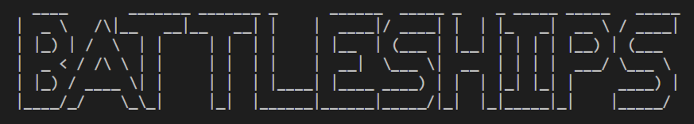
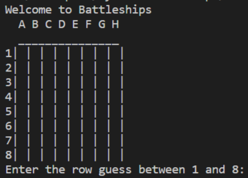
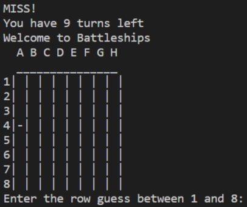
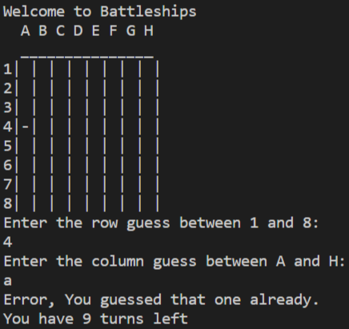
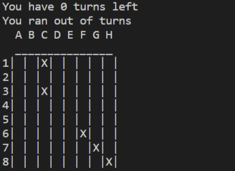
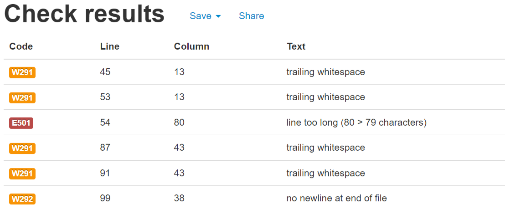
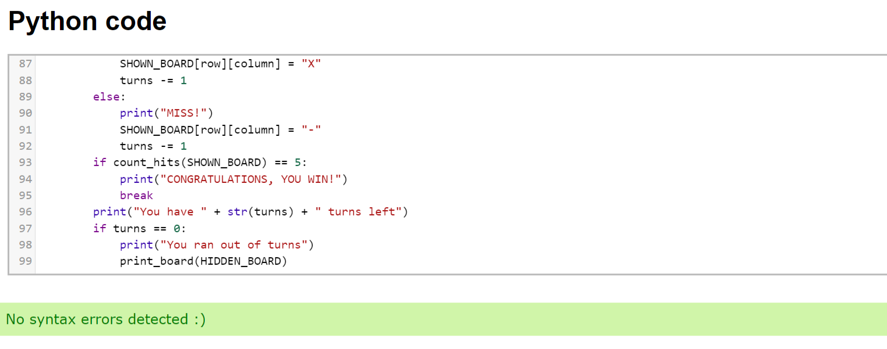

Welcome to Battleships!

# Intro

This is a simple guessing game where the computer generates a board with 5 ships and the player must sink them in 10 turns.

___

# How To Play

1. An empty board will be displayed and the player must input a row guess between 1 and 8.

2. The player will then input a column guess between A and H.

3. The empty board will display and show if its a HIT or MISS.
    HIT = X
    MISS = -

4. Repeat until either all ships are sunk or turns run out.

___

# User Experience

**Target Audience**

The target audience for this app are beginners to a battleships game and other users who want a casual gaming experience.

**User Stories**

1. As a user, I want a clear description as to how to play the game. End user goal: Understand rules of game. End business goal: Keep users playing game. Acceptance criteria: Place clear print messages telling player to input value, Add clear info of rules in README.

2. As a user, I want to be told if make a mistake. End user goal: Fix mistake to keep playing. End business goal: Keep users playing game. Acceptance criteria: Display error message when input is invalid, Return input.

3. As a user, I want to know how many turns I have left. End user goal: Know how many guesses are left. End business goal: Keep users playing game. Acceptance criteria: Display turns left when guess is a MISS.

___

# Features

# Testing

[Pep8](http://pep8online.com/)

[ExtendsClass](https://extendsclass.com/python-tester.html)

