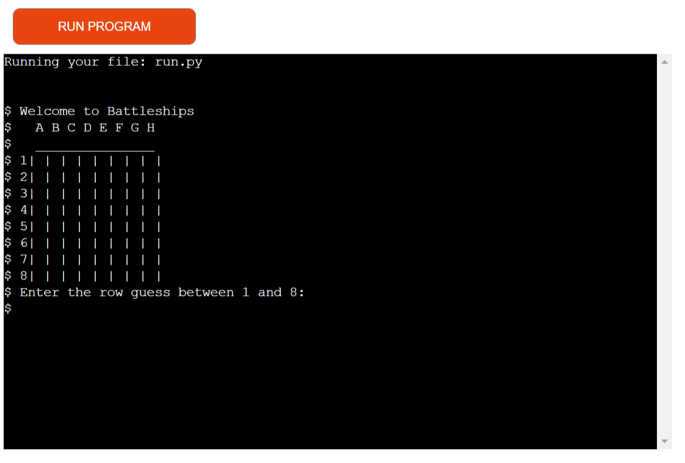

Welcome to Battleships!

# Intro

This is a simple guessing game where the computer generates a board with 5 ships and the player must sink them in 10 turns.

___

# How To Play

1. An empty board will be displayed and the player must input a row guess between 1 and 8.

2. The player will then input a column guess between A and H.

3. The empty board will display and show if its a HIT or MISS.
    HIT = X
    MISS = -

4. Repeat until either all ships are sunk or turns run out.

___

# User Experience

**Target Audience**

The target audience for this app are beginners to a battleships game and other users who want a casual gaming experience.

**User Stories**

1. As a user, I want a clear description as to how to play the game. End user goal: Understand rules of game. End business goal: Keep users playing game. Acceptance criteria: Place clear print messages telling player to input value, Add clear info of rules in README.

2. As a user, I want to be told if make a mistake. End user goal: Fix mistake to keep playing. End business goal: Keep users playing game. Acceptance criteria: Display error message when input is invalid, Return input.

3. As a user, I want to know how many turns I have left. End user goal: Know how many guesses are left. End business goal: Keep users playing game. Acceptance criteria: Display turns left when guess is a MISS.

___

# Features

# Testing

After creating the board and the function for the user to guess. I constantly played through the game ensuring that all error messages were working with each further addition and change.

One major addition that I almost overlooked was the *try* and *except* function that stops empty inputs being valid or crashing the game.

[Pep8](http://pep8online.com/)

Using Pep8, I pasted the finished code that yeilded minor warnings that some I was able to fix and one error that I was not but the app still runs smoothly.

[ExtendsClass](https://extendsclass.com/python-tester.html)

ExtendsClass showed no errors.

# Future Development

1. Add ability for user to create board and place ships and computer to guess.

2. Increase size of battleships so vary in sizes and allow for computer to use tactics to sink player ships.

# Deployment

**GitHub**

The app has been deployed to GitHub and a link to the page can be found here: [Python-Battleships - GitHub](https://github.com/mattm1346/Python-Battleships)

**Heroku**

The app has been deployed to Heroku and a link to the page can be found here: [Python-Battleships - Heroku](https://dashboard.heroku.com/apps/python-battleships)

*note - no secret key is needed*

